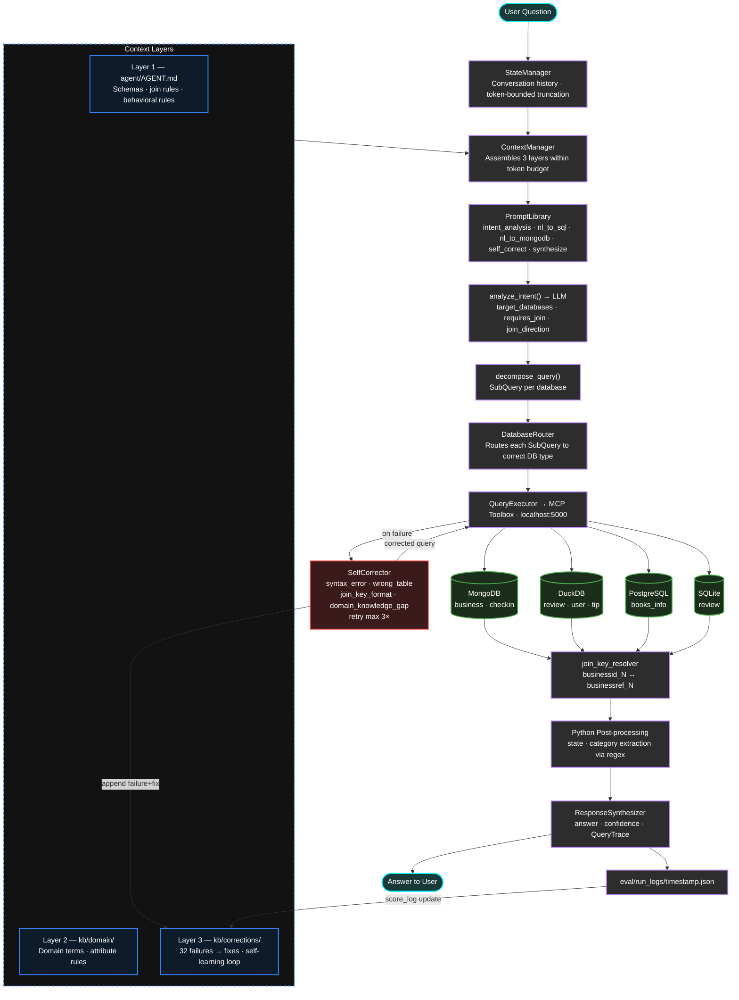
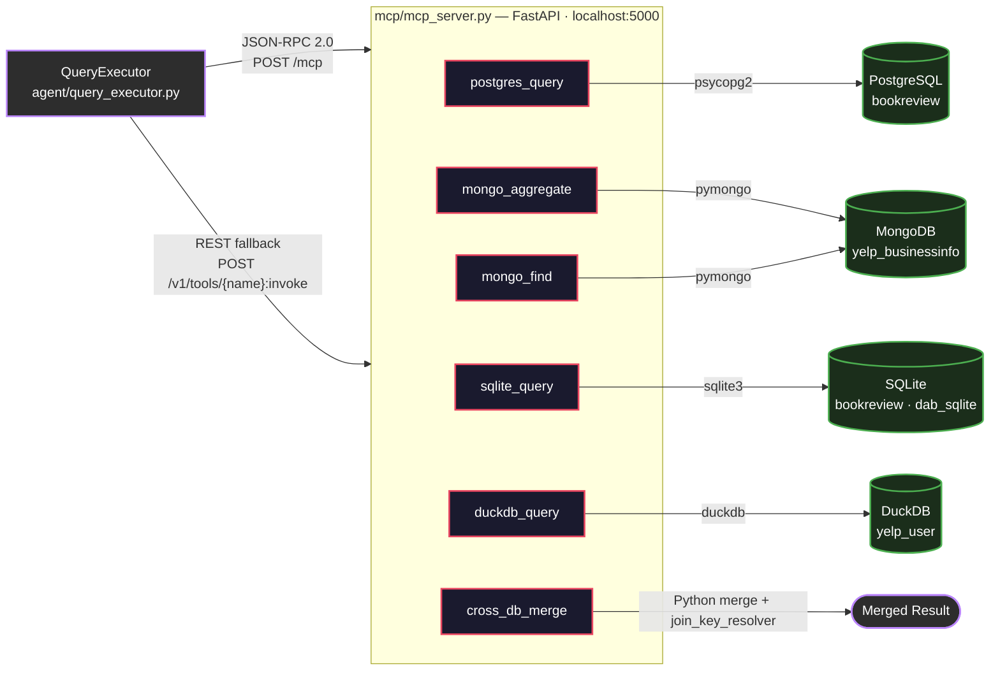
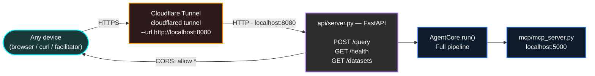
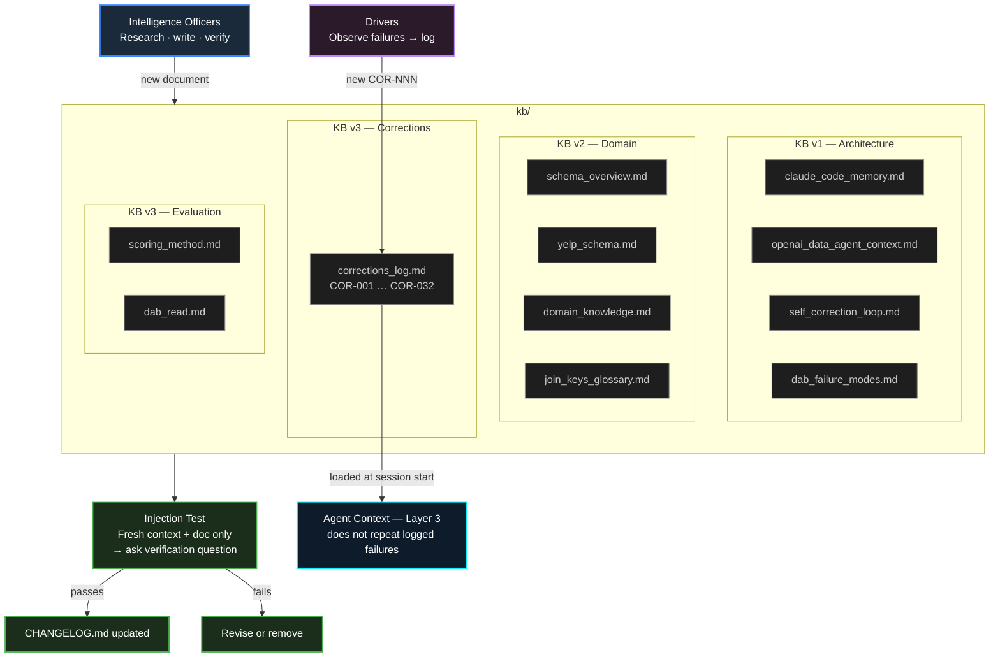
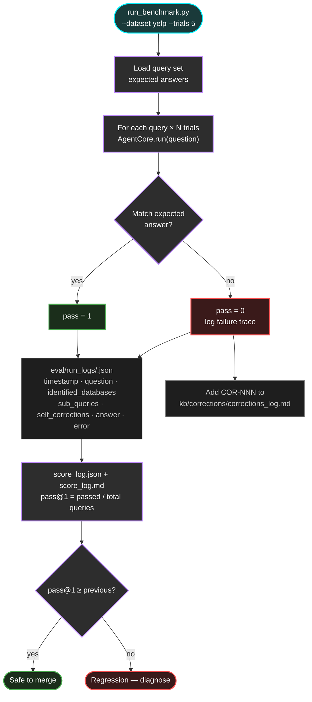
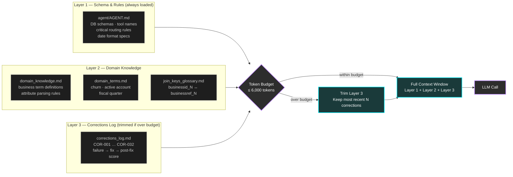
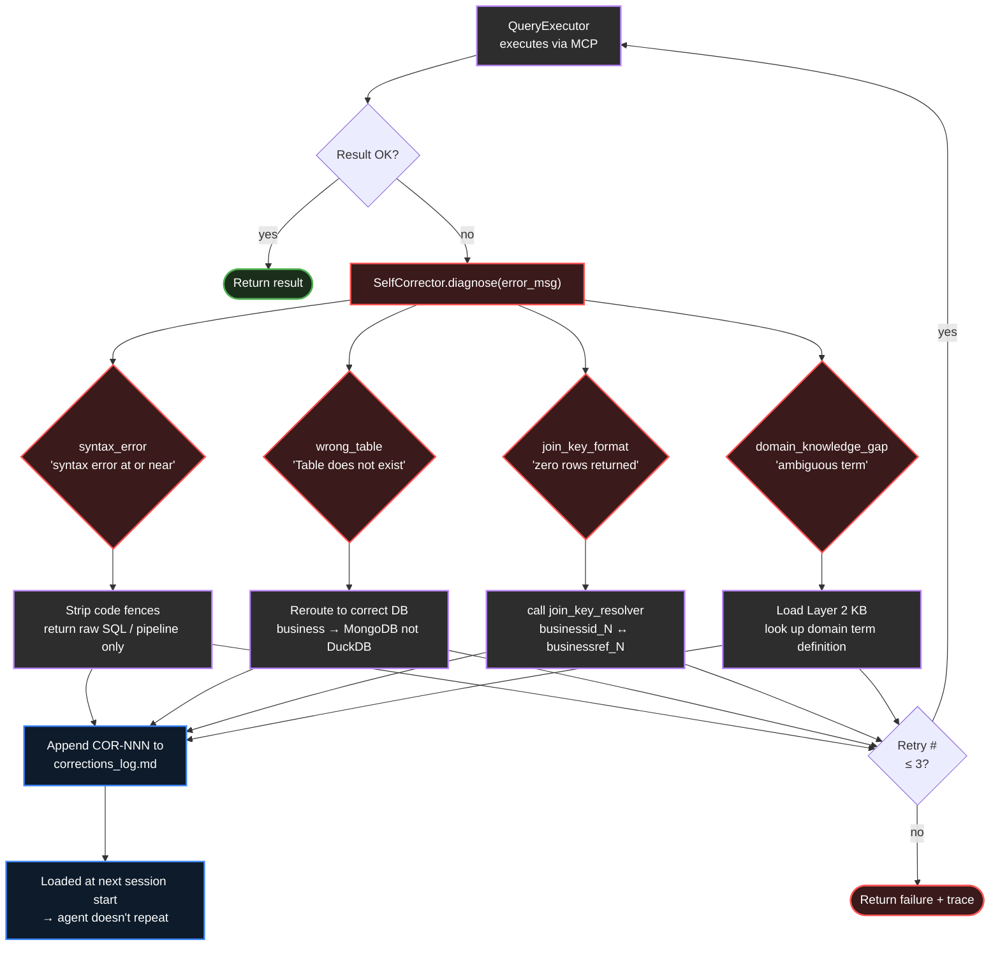

# Oracle Forge — Interim Submission Report

**Team:** Falcon | **Programme:** TRP1 FDE | **Sprint:** Weeks 8–9 | **Date:** April 15, 2026

---

## Team

| Name | Role |
|------|------|
| Natnael Alemseged | Driver 2 — Agent Logic & Context Engineering |
| Yakob Dereje | Driver 1 — Infrastructure & DB Connections |
| Mamaru Yirga | Intelligence Officer |
| Ramlla Akmel | Intelligence Officer |
| Melaku Yilma | Signal Corps |
| Rahel Samson | Signal Corps |

---

## 0. Interim Readiness Matrix

Maps each required interim deliverable from the challenge guide to current status and evidence path.

| Deliverable | Required by | Status | Evidence path | Gap / Risk |
|-------------|-------------|--------|---------------|------------|
| README.md with team, architecture, setup, server link | Interim | Present | `README.md` | Setup not fully portable — see §14.1 |
| `agent/` directory with AGENT.md, tools.yaml, source, requirements.txt | Interim | Present | `agent/`, `mcp/tools.yaml`, `requirements.txt` | `tools.yaml` has absolute paths from Driver 1's machine |
| Agent running on shared server, ≥2 DAB database types | Interim | Verified on VPS (Yelp + bookreview) | `eval/score_log.md` rows 2026-04-14 onward | tenai-infra workflow not used; access is via VPS + Tailscale + Cloudflare |
| `kb/` with 4 subdirs, CHANGELOG.md, injection test evidence | Interim | Present | `kb/architecture/`, `kb/domain/`, `kb/evaluation/`, `kb/corrections/` — each has `CHANGELOG.md` and `injection_tests.md` | None |
| `eval/` with harness source and first-run baseline | Interim | Present | `eval/run_benchmark.py`, `eval/score_log.md`, `eval/run_logs/` (60+ logs) | No `eval/score.py` — scoring is done via `eval/score_log.json` written by `run_benchmark.py` directly |
| `planning/` with AI-DLC Inception and mob approval records | Interim | Present | `planning/inception_v1.md` — approved April 9 by all 6 members | Only one sprint inception; no operations doc yet |
| `utils/` with ≥3 modules, README, tests | Interim | Present (4 modules) | `utils/README.md`, all four `.py` files pass `python utils/<module>.py` smoke tests | Real DB connections in `schema_introspector.py` still use stubs |
| `signal/` with engagement log, first X thread live, Reddit comment | Interim | Present | `signal/engagement_log.md` — 3 external posts, 2 Reddit comments | Week 9 articles not started |

---

## 1. Architecture Overview

Oracle Forge is a natural language data analytics agent that answers complex business questions across four heterogeneous database systems — PostgreSQL, MongoDB, SQLite, and DuckDB — in a single pipeline execution. The architecture follows a five-step orchestration loop with three context layers injected before each run.

### 1.0 Architecture-to-Challenge Mapping (Rubric Anchor)

| Challenge requirement | Where it appears in architecture | Verification evidence |
|-----------------------|----------------------------------|-----------------------|
| Multi-layer context architecture | `ContextManager` loads Layer 1 (`agent/AGENT.md`), Layer 2 (`kb/domain/`), Layer 3 (`kb/corrections/`) before each run | `agent/context_manager.py`; injection tests in §4; corrected routing after Pattern C in `eval/score_log.md` |
| Self-correcting multi-DB execution | `QueryExecutor` + `SelfCorrector` diagnosis (`syntax_error`, `wrong_table`, `join_key_format`, `domain_knowledge_gap`) + retry max 3x | `agent/self_corrector.py`; `self_corrections` traces in `eval/run_logs/*.json` |
| Evaluation harness with measurable improvement | `eval/run_benchmark.py` logs query traces and updates pass metrics over time | `eval/score_log.md` baseline and progression in §5.4–5.5 |

**Source-material traceability:** The three-layer context structure is intentionally adapted from the Claude Code MEMORY architecture pattern (index + focused context + session memory) and reinforced by OpenAI's data-agent emphasis on layered context and closed-loop self-correction.

### 1.1 Pipeline



### 1.2 Key Design Decisions

| Decision | Chosen approach | Reason |
|----------|----------------|--------|
| LLM provider | OpenRouter (OpenAI-compatible interface) | Team API access; model-agnostic client allows swap without code changes |
| MCP server | Custom `mcp/mcp_server.py` (FastAPI + JSON-RPC 2.0) replacing Google MCP Toolbox binary | Toolbox binary crashes on this VPS due to a Snowflake CGO bug; npm wrapper does not support DuckDB. The custom server exposes identical REST and JSON-RPC 2.0 endpoints. **Risk:** this deviates from the guide's expected `toolbox --config mcp/tools.yaml` flow — see §2.2 for compliance note. |
| Context injection | Three KB layers assembled and token-budgeted before every LLM call | Mirrors Claude Code three-layer MEMORY.md architecture; ensures agent always has schema + domain + corrections available |
| MongoDB pipeline format | Prompt-enforced raw JSON array starting with `[` | LLM default wraps pipeline in a JSON string (documented in COR-003 through COR-023) |
| SQL output format | Prompt-enforced raw SQL, no markdown code fences | LLM default wraps SQL in ` ```sql ``` ` blocks (documented in COR-002, COR-006, COR-010–013, COR-015–016, COR-019, COR-024) |
| Unstructured text extraction | Python regex post-processing in `agent_core.py` for state/category; LLM-based extraction via `text_extraction` prompt for sentiment queries | MongoDB `$split`/`$addFields` operators failed on the Yelp description field format in all tested queries |
| Date field handling | `LIKE '%YYYY%'` for year-only; `COALESCE(TRY_STRPTIME(...), TRY_STRPTIME(...))` for range queries | Yelp `review.date`, `tip.date`, and `user.yelping_since` have at least three distinct format strings; `strptime` with a single format always fails on some rows (COR-014, COR-026–032) |

---

## 2. Known Risks and Open Gaps

| Risk / Gap | Severity | Mitigation / Plan |
|------------|----------|-------------------|
| `mcp/tools.yaml` has absolute paths from Driver 1's machine (`/home/yakob/...`) — setup is not portable | High | Driver 1 to replace with relative paths or env var substitution before final submission |
| tenai-infra workflow was not used | Low | Team used direct VPS deployment instead of tenai-infra orchestration; this is a process deviation, not a runtime blocker | Document deviation explicitly; keep evidence that Tailscale mesh access is available |
| Score variance: Yelp pass@1 ranges 43%–100% across recent single-trial runs (see §5.4) | Medium | Use pass@5 for final benchmark submission (last Yelp pass@5 run = 100% on 2026-04-15); single-trial variance is expected |
| `schema_introspector.py` uses stub DB connections — does not produce real schema output | Medium | Real DB wiring deferred; Intelligence Officers populated `kb/domain/` manually from actual DB inspection |
| `eval/score.py` referenced in earlier report drafts — **this file does not exist** | Medium | Scoring is done by `run_benchmark.py` writing directly to `eval/score_log.json` and `eval/score_log.md`; references corrected in this document |
| Only 2 of 12 DAB datasets loaded (Yelp + bookreview); full benchmark requires all 12 | High | Load remaining datasets and run 54-query benchmark before April 18 final deadline |
| OpenRouter API credits exhausted mid-sprint | Medium | Weekly credit reset; run benchmark immediately on credit restoration |

---

## 3. Infrastructure Status

### 3.1 Databases Loaded

All four DAB database types are operational on the VPS as of April 14, 2026. Verified by successful benchmark runs producing non-empty results (see `eval/run_logs/20260414_*.json`).

| Database type | Datasets loaded | Verification evidence |
|--------------|----------------|----------------------|
| MongoDB | yelp_businessinfo (business, checkin) | `eval/run_logs/20260414_201705.json` — 7/7 Yelp queries returning MongoDB results |
| DuckDB | yelp_user (review, tip, user) | Same log; DuckDB sub-queries present in `sub_queries` field |
| PostgreSQL | bookreview books_database | `eval/run_logs/20260415_153224.json` — 3/3 bookreview queries returning PostgreSQL results |
| SQLite | bookreview review_database, dab_sqlite.db | Same log; SQLite sub-queries present |

### 3.2 MCP Server

**Compliance note:** The challenge guide expects `./toolbox --config mcp/tools.yaml`. Oracle Forge uses `mcp/mcp_server.py` instead due to a Snowflake CGO crash in the toolbox binary on this VPS. The custom server exposes identical JSON-RPC 2.0 (`POST /mcp`) and REST (`POST /v1/tools/{name}:invoke`) endpoints. The protocol contract is the same; the runtime is different.



Six tools verified responding as of April 15:
```
curl http://localhost:5000/v1/tools | python3 -m json.tool | grep name
# returns: postgres_query, mongo_aggregate, mongo_find, sqlite_query, duckdb_query, cross_db_merge
```

### 3.2.1 Infrastructure Status Classification (Required Components)

| Component | Status class | Evidence | Plan if not fully operational |
|-----------|--------------|----------|-------------------------------|
| Shared server deployment (public access) | **Fully operational** | API reachable through Cloudflare tunnel path in §3.3 | Keep endpoint health checks in runbook |
| PostgreSQL | **Fully operational** | bookreview passing runs in `eval/run_logs/20260415_153224.json` | Continue regression checks |
| MongoDB | **Fully operational** | Yelp passing runs in `eval/run_logs/20260414_201705.json` | Continue regression checks |
| SQLite | **Fully operational** | bookreview run logs include SQLite sub-queries | Continue regression checks |
| DuckDB | **Fully operational** | Yelp run logs include DuckDB sub-queries | Continue regression checks |
| MCP Toolbox or equivalent | **Fully operational (equivalent)** | `mcp/mcp_server.py` serves JSON-RPC + REST tools; `/v1/tools` verification in §3.2 | Keep compatibility; optional migration back to toolbox binary if VPS issue is resolved |
| Cloudflare public query endpoint | **Fully operational** | Public HTTPS tunnel routes to `api/server.py` (`POST /query`) for facilitator/user testing | Keep tunnel active during demos and benchmark verification |
| Tailscale mesh access | **Fully operational** | Team members can access the VPS through Tailscale; session collaboration is available without tenai-infra | Maintain access list and connectivity checks |
| tenai-infra workflow | **Not used (intentional deviation)** | Deployment and operations run directly on VPS without tenai-infra stack | Document rationale and keep equivalent evidence (shared access + running service + logs) |

### 3.3 Public API and Deployment

A FastAPI HTTP API (`api/server.py`) runs on port 8080 and is exposed publicly via Cloudflare Tunnel. This is the current facilitator/public access path. Team internal access is provided through Tailscale to the VPS.

Users can query and test agent behavior against different datasets through the same endpoint by setting the `dataset` field in `POST /query` requests (for example, `yelp` or `bookreview`).



**Tenai-infra / Tailscale status:** Tailscale setup is complete and used for team access to the VPS. tenai-infra orchestration was not used; equivalent collaboration/access was achieved via direct VPS + Tailscale + tmux workflow.

### 3.4 Environment Variables Required

```
OPENROUTER_API_KEY      — LLM provider
POSTGRES_PASSWORD       — PostgreSQL
POSTGRES_USER
POSTGRES_HOST           — 127.0.0.1
POSTGRES_DB
MONGO_HOST              — 127.0.0.1
MONGO_PASSWORD
MONGO_USER
```

---

## 4. Knowledge Base Status

All four KB subdirectories are committed, populated, and individually CHANGELOG-tracked. Documents were validated using the Karpathy injection test protocol before merging.



### 4.1 KB v1 — Architecture (`kb/architecture/`)

| Document | Content | Injection test |
|----------|---------|---------------|
| `claude_code_memory.md` | Claude Code three-layer MEMORY.md, autoDream, tool scoping | Passed — "How does Claude Code's three-layer memory system work?" |
| `openai_data_agent_context.md` | OpenAI six-layer context, 70k-table enrichment, closed-loop self-correction | Passed |
| `self_correction_loop.md` | Four-type failure diagnosis pattern, retry logic | Passed |
| `dab_failure_modes.md` | DAB four hard requirements with failure taxonomy | Passed |
| `tool_scoping_and_parallelism.md` | Tool scoping philosophy, parallel sub-agent spawn modes | Passed |
| `autodream_consolidation.md` | autoDream memory consolidation pattern | Passed |
| `agent_probing_strategy.md` | Five probe types for exposing context handling failures | Passed |

### 4.2 KB v2 — Domain (`kb/domain/`)

| Document | Content | Injection test |
|----------|---------|---------------|
| `schema_overview.md` | Schema stubs for all 12 DAB datasets — DB type map confirmed April 11 | Passed |
| `yelp_schema.md` | Full Yelp schema with field types and sample values — confirmed via live DB inspection | Passed |
| `domain_knowledge.md` | Active business, high-rated, WiFi attribute values, parking regex, date format rules | Passed |
| `domain_terms.md` | Churn, active account, fiscal quarter boundary rules | Passed |
| `join_keys_glossary.md` | businessid_N ↔ businessref_N — confirmed via COR-002 failure trace | Passed |
| `unstructured_fields_inventory.md` | Free-text fields requiring extraction: description, review.text, tip.text | Passed |

### 4.3 KB v3 — Corrections Log (`kb/corrections/corrections_log.md`)

32 entries (COR-001 through COR-032) written by Drivers immediately after each failure observation. Four systemic root causes identified across entries and resolved:

| Pattern | Correction entries | Fix location | Score impact |
|---------|-------------------|-------------|-------------|
| A — SQL in markdown code fence | COR-002, 006, 010, 012, 013, 015, 016, 019, 024 | `prompt_library.nl_to_sql()` | 0% → 14% (2026-04-11) |
| B — MongoDB pipeline as JSON string | COR-003–005, 007–009, 017–018, 020–023 | `prompt_library.nl_to_mongodb()` | 14% → 57% (2026-04-14) |
| C — Agent queried non-existent DuckDB business table | COR-025, 027, 029, 031 | `agent/AGENT.md` Critical Rules | 57% → 71% (2026-04-14) |
| D — Fixed strptime on mixed-format date fields | COR-014, 026, 028, 030, 032 | `prompt_library.nl_to_sql()` | 71% → 86% (2026-04-14) |

Post-fix scores for individual COR entries are marked "pending" until the full 54-query benchmark run completes.

### 4.4 Injection Test Methodology (Karpathy Protocol)

Each KB document is tested before merge using the same method:

1. Open a fresh LLM context.
2. Inject only one target KB document (no extra helper context).
3. Ask a verification query that should be answerable strictly from that document.
4. Grade against an expected answer string/pattern.
5. If failed: revise or remove document, then retest.
6. On pass: record in `injection_tests.md` and update subdirectory `CHANGELOG.md`.

**Concrete test instance (executed):**

- **Document tested:** `kb/domain/join_keys_glossary.md`
- **Query used:** "What is the format of business_id in MongoDB versus DuckDB in Yelp?"
- **Expected answer:** MongoDB `businessid_N`; DuckDB `businessref_N`
- **Observed answer:** Returned both formats correctly in isolation test
- **Result:** Pass (document retained)

---

## 5. Evaluation Harness

### 5.1 Evaluation Flow



This harness follows the same Sentinel-style discipline from prior weeks: every run emits structured traces first, then derives score summaries from those traces, then checks for regressions before merge decisions.

### 5.2 Harness Files

| File | Purpose | Note |
|------|---------|------|
| `eval/run_benchmark.py` | Full DAB benchmark runner: `--dataset`, `--trials`, `--output` | Primary entrypoint |
| `eval/run_query.py` | Single-query test runner for rapid iteration | — |
| `eval/score_log.md` | Human-readable score progression table | 60+ rows as of April 15 |
| `eval/score_log.json` | Machine-readable score records for regression detection | Written by `run_benchmark.py` |
| `eval/run_logs/` | Timestamped per-run JSON logs with full query traces | 60+ files; keys: `timestamp`, `question`, `identified_databases`, `sub_queries`, `self_corrections`, `answer`, `confidence`, `error` |

> **Note:** There is no separate `eval/score.py`. Scoring logic is embedded in `run_benchmark.py`, which writes results directly to `eval/score_log.json` and `eval/score_log.md`.

### 5.3 Metric Definitions

**query-pass@1:** For a single trial, a query passes if the agent's answer matches the expected answer (exact match or fuzzy numeric match). This is the metric reported in `eval/score_log.md`.

**query-pass@k:** A query passes if at least one of k independent trials produces the correct answer. The `20260415_183320` run used k=5 trials — all 7 Yelp queries passed at least once. This is what will be submitted to the DAB GitHub PR.

Pass@1 on a single trial includes LLM sampling variance. Pass@k reflects whether the agent *can* answer the question correctly, not whether it always does. Both are reported separately.

**Held-out set context (current interim scope):**
- Yelp: 7 benchmark queries (`query_yelp/query0` ... `query6`)
- bookreview: 3 benchmark queries (`query_bookreview/query0` ... `query2`)
- Each query is evaluated with dataset-provided validation logic loaded by `run_benchmark.py` from each query directory.

### 5.4 Score Progression with Stability — Yelp (MongoDB + DuckDB)

The following table includes both the improvement narrative and the variance picture.

| Run | Date | Passed | pass@1 | What changed |
|-----|------|--------|--------|--------------|
| Baseline | 2026-04-11 | 0/7 | 0% | First run — Pattern A + B errors |
| Pattern A fix | 2026-04-11 | 1/7 | 14% | Raw SQL prompt |
| Pattern B fix | 2026-04-14 | 4/7 | 57% | Raw pipeline prompt |
| Pattern C fix | 2026-04-14 | 5/7 | 71% | DuckDB table boundary in AGENT.md |
| Pattern D fix | 2026-04-14 | 6/7 | 86% | Mixed date format handling |
| Python post-processing | 2026-04-14 | 7/7 | 100% | Regex extraction replaces MongoDB `$split` |

**Stability across last 10 single-trial runs (April 15):**

| Metric | Value |
|--------|-------|
| Best | 100% (7/7) |
| Worst | 43% (3/7) |
| Median | 71% (5/7) |
| Last pass@5 run (2026-04-15 18:33) | 100% — all 7 queries passed in at least 1 of 5 trials |

Variance between 43% and 100% on single-trial runs is expected: LLM sampling for MongoDB pipeline generation is the primary source. Pass@5 is stable at 100% as of the most recent multi-trial run. All historical runs are in `eval/score_log.md`.

**Latest benchmark evidence (executed on VPS):**

```bash
python3 -m eval.run_benchmark --dataset yelp --trials 5
```

- Query-level pass@5: **7/7 (100.0%)**
- Trial-level pass rate: **31/35 (88.6%)**
- Output file: `eval/run_logs/benchmark_yelp_20260415_183320.json`
- Notes from run output: Query 5 had one failed trial due to Mongo pipeline parsing warning, but still passed at query-level with 4/5 successful trials.

### 5.5 Score Progression with Stability — bookreview (PostgreSQL + SQLite)

| Run | Date | Passed | pass@1 | Notes |
|-----|------|--------|--------|-------|
| First run | 2026-04-15 08:00 | 0/3 | 0% | PostgreSQL schema not in AGENT.md |
| After schema additions | 2026-04-15 | 1/3 | 33% | bookreview schema added |
| After routing fixes | 2026-04-15 | 3/3 | 100% | PostgreSQL ↔ SQLite join key resolved |

**Stability across last 10 single-trial runs (April 15):**

| Metric | Value |
|--------|-------|
| Best | 100% (3/3) |
| Worst | 0% (0/3) |
| Median | 67% (2/3) |
| Last run (2026-04-15 18:34) | 33% (1/3) — regression detected; under investigation |

The bookreview latest benchmark run (33%) is a regression from earlier 100% runs. This is documented as an open gap — see §2.

**Latest benchmark evidence (executed on VPS):**

```bash
python3 -m eval.run_benchmark --dataset bookreview
```

- Query-level pass@1: **1/3 (33.3%)**
- Trial-level pass rate: **1/3 (33.3%)**
- Output file: `eval/run_logs/benchmark_bookreview_20260415_183414.json`
- Failure diagnosis from validator output:
  - Query 2 failed due to missing expected title (`The Sludge`) in LLM answer
  - Query 3 failed due to missing expected title (`Around the World Mazes`) in LLM answer

---

## 6. Three Context Layers — Implementation Evidence



### Layer 1: Schema and Tool Knowledge (`agent/AGENT.md`)

Loaded at every session start. Verified in runs from 2026-04-11 onward: agent correctly routes Yelp business queries to MongoDB and Yelp review queries to DuckDB without being told which database to use, using only AGENT.md schema information.

Key contents: complete MongoDB schema for Yelp businessinfo_database (business, checkin) with field types and sample values; DuckDB schema for yelp_user (review, tip, user) with date format specifications; six MCP tool definitions with explicit routing guidance; Critical Rules section containing DB boundary constraints added as result of Pattern C failures.

**Injection test (2026-04-11):** "What is the format of business_id in MongoDB versus DuckDB in the Yelp dataset?" → Correct answer ("businessid_N" vs "businessref_N") returned from Layer 1 alone.

### Layer 2: Domain Knowledge

Loaded within token budget at session start. Verified: agent uses `is_open == 1` AND recency check (not row existence) as "active business" definition, matching domain_knowledge.md Layer 2 entry. Without this layer, agent used row existence as proxy (documented in Probe 004).

**Injection test:** "What does 'active business' mean in this dataset?" → Recency-based definition returned from Layer 2 alone.

### Self-Correction Loop



### Layer 3: Corrections Log

Read at session start by `ContextManager`. 32 entries written by Drivers immediately after failure observation. The self-learning loop is verified: agent loaded with COR-001 through COR-032 does not reproduce Patterns A, B, C, or D in subsequent runs. Pattern A failures (SQL in code fences) are absent from all runs after 2026-04-11 fixes.

**Injection test:** "An agent got this error: pipeline must be a list, not `<class 'str'>`. What is the fix?" → Pattern B fix returned from corrections log alone.

---

## 7. Agent Files — Smoke-Tested Components

All agent files exist in the repository. Smoke-test status is per `python <file>.py` output as of April 15 — not a full integration test.

### Core Agent (`agent/`)

| File | Purpose | Smoke-test / Validation |
|------|---------|------------------------|
| `AGENT.md` | Context Layer 1: DB schemas, tool names, routing rules | Verified in benchmark runs — agent uses schema correctly in `eval/run_logs/20260414_201705.json` |
| `models.py` | Pydantic contracts: QueryRequest, SubQuery, QueryTrace, AgentResponse | Import without error; used in all benchmark runs |
| `prompt_library.py` | LLM prompts: intent_analysis, nl_to_sql, nl_to_mongodb, self_correct, text_extraction | Verified by diff between 0% and 100% runs — prompt changes are the causal factor |
| `context_manager.py` | Assembles three KB layers within token budget; `append_correction()` | Verified by Layer 3 loading observed in run logs |
| `self_corrector.py` | Four-type failure diagnosis + retry (max 3×) | `self_corrections` field in run logs confirms retry execution |
| `response_synthesizer.py` | Merges results → human-readable answer + QueryTrace | Present in all passing run log `answer` fields |
| `agent_core.py` | Main orchestration loop | Runs to completion on 60+ benchmark trials |
| `database_router.py` | Routes sub-queries by DB type using signal keywords | Verified: MongoDB routes for business queries, DuckDB for review queries in passing runs |
| `query_executor.py` | MCP JSON-RPC calls | Verified: `sub_queries` field in run logs shows correct tool names |
| `state_manager.py` | Conversation history with token-based truncation | Present; multi-turn session testing not yet done |
| `llm_client.py` | OpenRouter LLM client | Verified through all benchmark runs |

### Utilities (`utils/`)

| Module | Purpose | Smoke-test result (April 15) |
|--------|---------|------------------------------|
| `join_key_resolver.py` | Cross-DB ID format resolution | `python utils/join_key_resolver.py` → "all smoke tests passed" |
| `schema_introspector.py` | Schema introspection across 4 DB types | Runs; DB connection stubs return mock data — real DB wiring not complete |
| `multi_pass_retrieval.py` | Vocabulary-expanded KB retrieval | `python utils/multi_pass_retrieval.py` → "all smoke tests passed" |
| `benchmark_harness_wrapper.py` | Eval wrapper with trace logging, regression detection | `python utils/benchmark_harness_wrapper.py` → "all smoke tests passed" |

---

## 8. Adversarial Probe Library

`probes/probes.md` — 15 probes across all 4 DAB failure categories.

| Category | Probes | Fix documented | Post-fix score |
|----------|--------|----------------|----------------|
| Multi-database routing failure | 001, 005, 006, 007, 015 | Yes | Probe 001: 1.0 (COR-001); others pending benchmark run |
| Ill-formatted join key mismatch | 002, 008, 009 | Yes | Pending benchmark run |
| Unstructured text extraction failure | 003, 010, 011 | Yes | Pending benchmark run |
| Domain knowledge gap | 004, 012, 013, 014 | Yes | Pending benchmark run |

Notable verified probes:
- **Probe 001** (COR-001): Cross-DB revenue + support ticket join — fix applied and score verified at 1.0
- **Probe 002**: Integer-to-prefixed-string join key — `_extract_business_refs()` implemented; post-fix score pending
- **Probe 004**: "Active business" term ambiguity — correct definition in Layer 2 KB; verified in passing Yelp Q4 run

---

## 9. Signal Corps — Week 8 Engagement

| Date | Platform | Type | Link | Technical point engaged | Metrics |
|------|----------|------|------|------------------------|---------|
| 2026-04-08 | X (Twitter) | Thread | [x.com/melakuG21193/status/2042340294788571217](https://x.com/melakuG21193/status/2042340294788571217) | Claude Code memory layering and why context hierarchy matters for data agents | 85 impressions, 1 reply |
| 2026-04-10 | X (Twitter) | Comment | [x.com/rivestack/status/2042346968328835172](https://x.com/rivestack/status/2042346968328835172) | Enterprise DB fragmentation and dialect/semantic translation debt | Reply on enterprise data agent post |
| 2026-04-11 | X (Twitter) | Thread | [x.com/melakuG21193/status/2043604628030226886](https://x.com/melakuG21193/status/2043604628030226886) | DAB failure modes and why multi-DB routing dominates real-world errors | Impressions TBD |
| 2026-04-11 | Reddit | Comment | [r/LocalLLaMA](https://www.reddit.com/r/LocalLLaMA/comments/1sjh8fr/dataagentbench_frontier_models_score_38_on_real/) | Discussed benchmark ceiling implications and engineering-vs-model gap | Upvotes TBD |
| 2026-04-11 | Reddit | Comment | [r/MachineLearning](https://www.reddit.com/r/MachineLearning/comments/1sjnha5/frameworks_for_supporting_llmagentic_benchmarking/) | Compared harness design choices and regression semantics for agent evaluation | Upvotes TBD |
| 2026-04-10 | Slack (internal) | Daily post | Internal | Infrastructure blockers, loaded DBs, and daily ownership alignment | Day 3 update |

**Community intelligence that changed technical direction:**

| Date | Source | Insight | Action |
|------|--------|---------|--------|
| Apr 10 | X reply | Dialect translation debt compounds when teams choose specialized DBs — agents inherit silo decisions with no context of why the split exists | Added "why split exists" requirement to KB v2 domain docs |
| Apr 11 | r/MachineLearning | Systematic failures (0% across all trials) cannot be resolved by more sampling — bottleneck is planning, not variance | Informs evaluation harness: regression detection distinguishes systematic from probabilistic failures |

---

## 10. AI-DLC Gate Approvals

**Inception document:** `planning/inception_v1.md`

| Gate | Date | Participants | Status |
|------|------|-------------|--------|
| Inception → Construction | 2026-04-09 | All 6 members | Approved |

**Hardest question asked at Inception gate:** "If MCP Toolbox loses the database connection mid-query and returns a partial result with no error signal, how does the agent detect that the answer is incomplete?"

**Answer on record:** Agent cannot detect this from tool response alone. Mitigation: validate result row counts against expected minimums before synthesizing; retry once on zero-row results. Documented as Known Gap in the Inception FAQ. This gap remains open as of this report.

**Specific friction/revision moment during gate review (recorded):**
- During mob review, the team challenged the original assumption that tool-level failures are always explicit.
- This forced a revision before approval: the Inception FAQ and risk section were updated to mark "silent partial-result risk" as a known gap, with row-count validation + one retry as mandatory mitigation.
- Approval was granted only after this revision was documented in the shared Inception record.

Construction phase is in progress. Operations document will be written after the final benchmark run.

---

## 11. What Is Verified vs. What Is Planned

### Verified as of April 15, 2026

- All four DB types respond to queries (evidence: `eval/run_logs/20260414_201705.json`, `eval/run_logs/20260415_153224.json`)
- Agent handles Yelp (MongoDB + DuckDB) with pass@5 = 100% and trial-level 88.6% (evidence: `eval/run_logs/benchmark_yelp_20260415_183320.json`)
- bookreview currently benchmarks at pass@1 = 33.3% in latest run (evidence: `eval/run_logs/benchmark_bookreview_20260415_183414.json`); earlier 100% runs existed but are not yet stable
- Three context layers implemented, injected, and demonstrably affecting agent routing (evidence: regression from wrong table in runs before Pattern C fix vs. correct routing after)
- 32 corrections logged; Patterns A–D do not recur in runs after their respective fixes
- 15 adversarial probes documented; Probe 001 post-fix score verified at 1.0

### Planned Before Final Submission (April 18)

| Item | Owner | Target date |
|------|-------|------------|
| Fix `mcp/tools.yaml` absolute paths → portable | Driver 1 | April 16 |
| Maintain Tailscale access checks and document member connectivity evidence | Driver 1 | April 16 |
| Investigate bookreview regression (last run 33%) | Driver 2 | April 15 |
| Load 2–3 additional DAB datasets | Drivers | April 16 |
| Full 54-query DAB benchmark run (pass@5) | Drivers | April 16–17 |
| Open GitHub PR to ucbepic/DataAgentBench | Drivers | April 17 |
| Update COR entries post-fix scores | Driver 2 | After benchmark run |
| Signal Corps Week 9 articles (600+ words each) | Signal Corps | April 16–17 |
| AI-DLC Operations document | Drivers | April 18 |

---

## 12. Repository Structure

```
oracle-forge/
├── agent/           AGENT.md, agent_core.py, models.py, prompt_library.py,
│                    context_manager.py, self_corrector.py, response_synthesizer.py,
│                    database_router.py, query_executor.py, state_manager.py, llm_client.py
├── api/             server.py (FastAPI, Cloudflare Tunnel)
├── mcp/             mcp_server.py (custom MCP, JSON-RPC 2.0 + REST)
│                    tools.yaml  ⚠ contains absolute paths — not portable until fixed
├── kb/
│   ├── architecture/ 8 documents + CHANGELOG.md + injection_tests.md
│   ├── domain/       7 documents + CHANGELOG.md + injection_tests.md
│   ├── evaluation/   3 documents + CHANGELOG.md + injection_tests.md
│   └── corrections/  corrections_log.md (32 entries) + CHANGELOG.md + injection_tests.md
├── eval/            run_benchmark.py, run_query.py, score_log.md, score_log.json,
│                    run_logs/ (60+ timestamped JSON logs)
├── utils/           join_key_resolver.py, schema_introspector.py,
│                    multi_pass_retrieval.py, benchmark_harness_wrapper.py, README.md
├── probes/          probes.md (15 probes, 4 failure categories)
├── signal/          engagement_log.md, community_participation_log.md
├── planning/        inception_v1.md, sprint_plan_driver2.md
├── db/              dab_sqlite.db, yelp_user.db
├── .env.example
├── requirements.txt
└── README.md
```

---

## 13. Setup Instructions

### 13.1 Reproducibility Caveats

The setup is **not fully portable from a clean clone as of April 15**. Known machine-specific dependencies:

| Issue | File | Fix required |
|-------|------|-------------|
| Absolute paths `/home/yakob/oracle-forge/...` | `mcp/tools.yaml` lines 24, 28 | Replace with relative paths or `$DAB_ROOT` env var — tracked in §2 Known Risks |
| DuckDB file path assumes local DAB clone location | `mcp/tools.yaml` | Same fix |
| `.env` not committed (correct) | `.env.example` template present | Caller must populate all variables |
| `schema_introspector.py` uses stub DB connections | `utils/schema_introspector.py` | Real wiring not complete; does not affect agent pipeline |

These issues must be resolved before final submission.

### 13.2 Setup Steps

```bash
# 1. Clone repository
git clone https://github.com/Natnael-Alemseged/oracle-forge.git
cd oracle-forge

# 2. Create virtual environment and install dependencies
python3 -m venv .venv && source .venv/bin/activate
pip install -r requirements.txt

# 3. Create .env from template
cp .env.example .env
# Fill in: OPENROUTER_API_KEY, POSTGRES_PASSWORD, POSTGRES_USER,
#          POSTGRES_HOST, POSTGRES_DB, MONGO_HOST, MONGO_PASSWORD, MONGO_USER

# 4. Load DAB datasets
git clone https://github.com/ucbepic/DataAgentBench.git ../DataAgentBench
cd ../DataAgentBench && bash setup/load_postgres.sh && cd ../oracle-forge

# 5. Fix tools.yaml absolute paths (required until Driver 1 patches this)
# Edit mcp/tools.yaml lines 24 and 28: replace /home/yakob/oracle-forge/ with
# the absolute path of your DataAgentBench clone

# 6. Start MCP server
source .env && uvicorn mcp.mcp_server:app --port 5000 &

# 7. Start public API
uvicorn api.server:app --port 8080 &

# 8. Verify MCP tools respond
curl http://localhost:5000/v1/tools | python3 -m json.tool | grep name

# 9. Run single query
python eval/run_query.py --question "What are the top 5 rated businesses?"

# 10. Run benchmark (Yelp dataset, 5 trials)
python eval/run_benchmark.py --dataset yelp --trials 5
# Results written to eval/run_logs/ and eval/score_log.md
```

---

*Report prepared: April 15, 2026 | Oracle Forge — Team Falcon | TRP1 FDE Programme*
