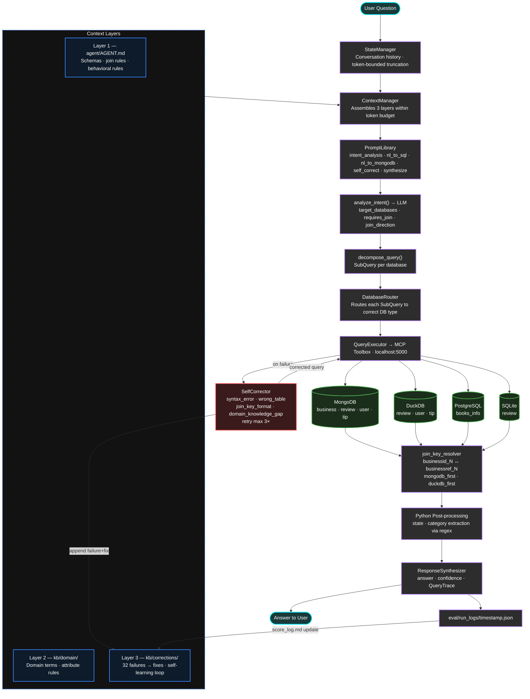
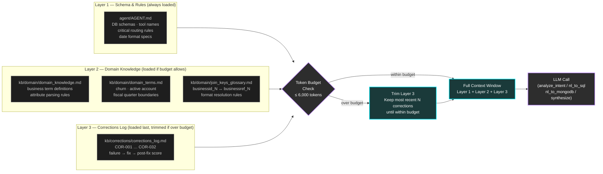
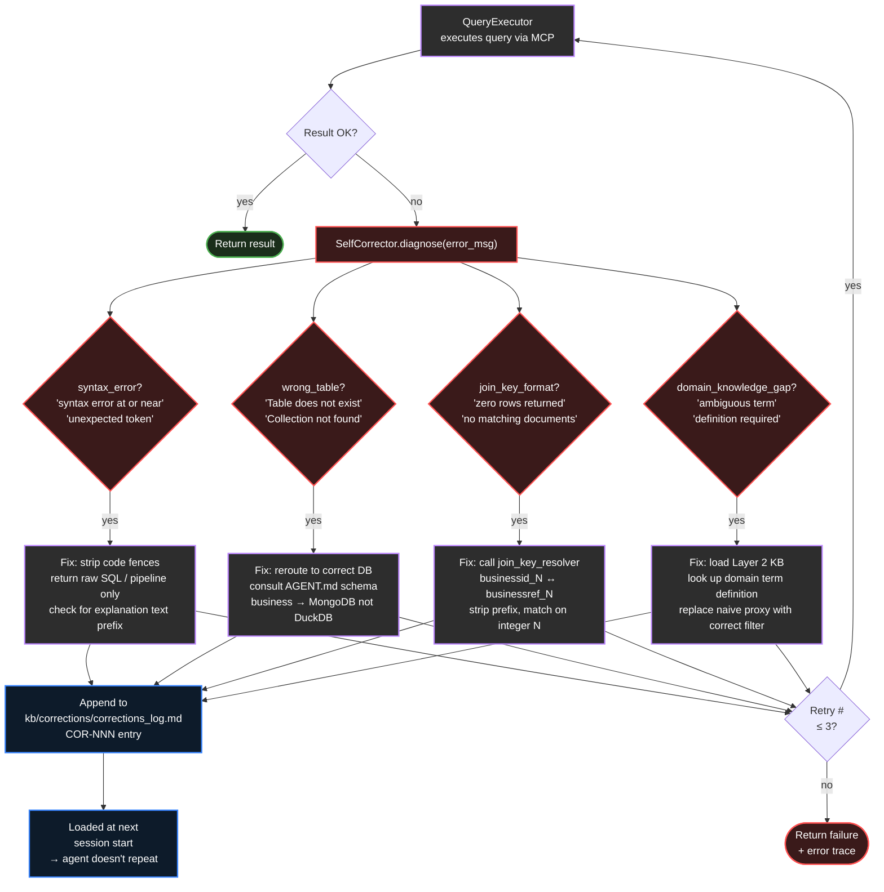
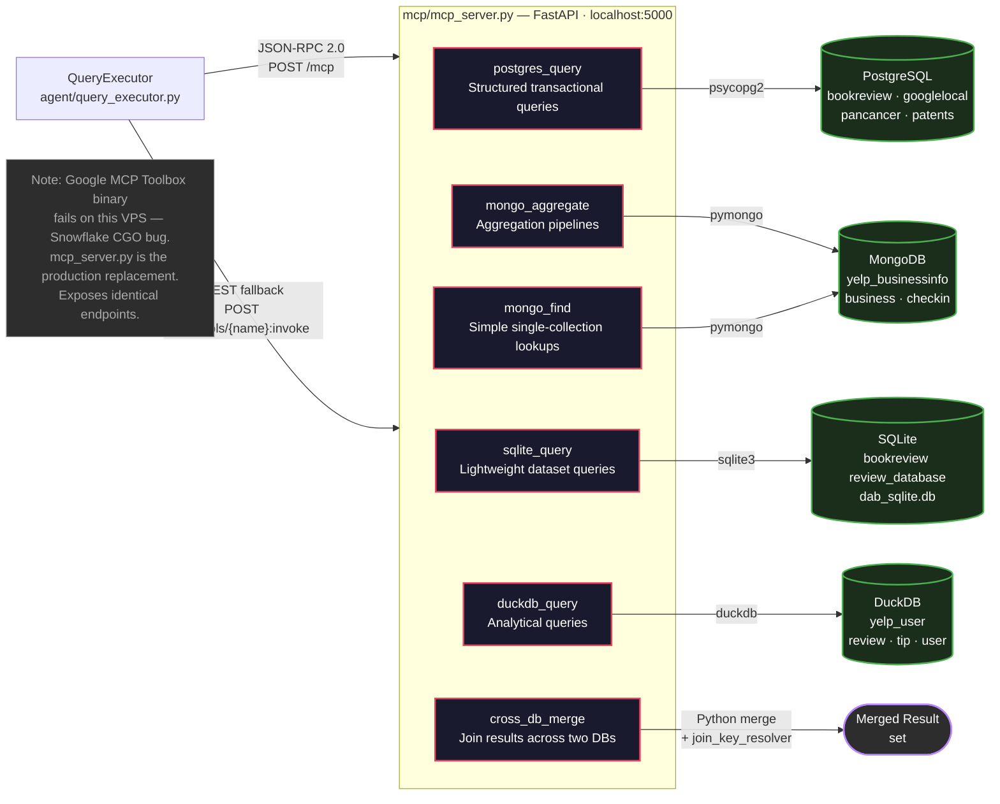
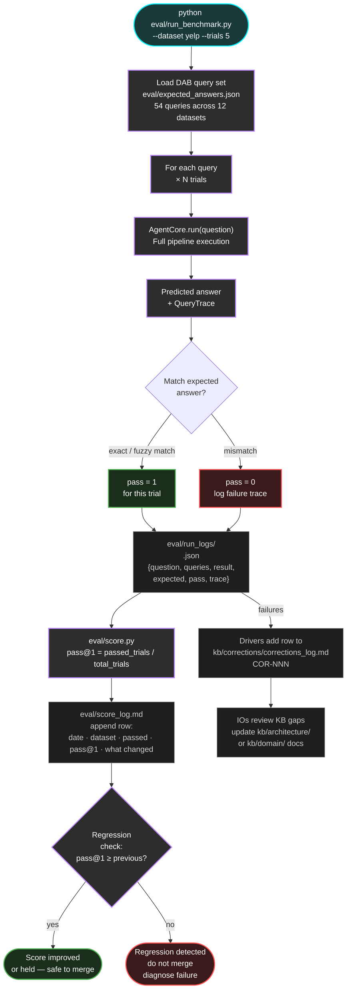
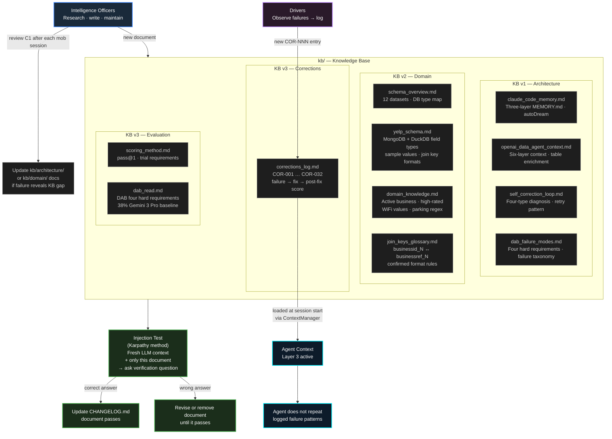
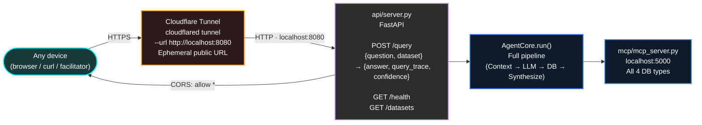

# Oracle Forge — Architecture Diagrams

---

## Diagram 1 — Main Agent Pipeline

---

## Diagram 2 — Three-Layer Context Assembly

How `ContextManager` builds the prompt context window before every LLM call, respecting the token budget.

---

## Diagram 3 — Self-Correction Loop

Detailed view of how `SelfCorrector` diagnoses failures and feeds the corrections log.

---

## Diagram 4 — MCP Server and Database Layer

How `QueryExecutor` reaches all four database types through the custom MCP server.

---

## Diagram 5 — Evaluation Harness and Score Loop

How a benchmark run flows from query input to score log update.

---

## Diagram 6 — Knowledge Base Structure and Maintenance Flow

How the KB is built, tested, and kept current by Intelligence Officers and Drivers.

---

## Diagram 7 — Public API and Deployment

How external traffic reaches the agent from any device.

